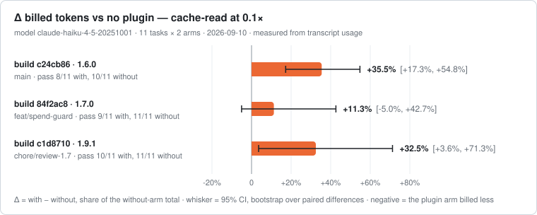
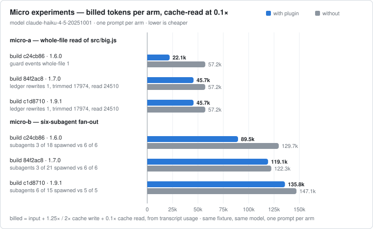

<div align="center">

# handoff-os

**Spend guard for Claude Code** — acts at `PreToolUse` and `Stop`, before the tokens are spent.

[](plugins/handoff-os/.claude-plugin/plugin.json)
[](https://github.com/serio-ngo/handoff-os/actions/workflows/verify.yml)
[](LICENSE)
[](#install)

[](docs/BENCHMARK.md)
[](docs/BENCHMARK.md)
[](plugins/handoff-os/scripts)
[](package.json)


<sub>[What changes](#what-changes-for-you) · [Install](#install) · [Measured](#measured--replayed-against-real-traffic) · [Limits](#limits) · [Benchmark](docs/BENCHMARK.md)</sub>

</div>

<table>
<tr>
<th align="left" width="50%">Stops</th>
<th align="left" width="28%">Counts</th>
<th align="left" width="22%">Does not</th>
</tr>
<tr valign="top">
<td>
<b>4th agent</b> in a 90-second wave — held for the next wave<br>
<b>opus/fable dispatch</b> with no <code>QUALITY:</code> flag — refused, scout or runner named<br>
<b>Whole-file read</b> over 24 KB — rewritten to a slice<br>
<b>Byte-identical re-read</b>, repeat search — refused<br>
<b>9th whole file</b> in one thread — handed to a scout<br>
<b>Content grep</b> with no <code>head_limit</code> — capped at 50 lines<br>
<b>Send, pay, publish, merge, delete</b> — refused, human-only
</td>
<td>
<b>Tokens kept out</b> of the main thread — bytes / 4, an estimate<br>
<b>Billed tokens</b> — transcript <code>usage</code>, measured<br>
<b>Receipt at <code>Stop</code></b> — agents held back, tokens kept out, plugin footprint
</td>
<td>
<b>Dependencies</b> — zero<br>
<b>Model calls</b> — none<br>
<b>Network</b> — none, fully offline<br>
<b>Telemetry</b> — none
</td>
</tr>
</table>

## Install

```text
/plugin marketplace add serio-ngo/handoff-os
/plugin install handoff-os@serio-ngo
```

> Hooks load at session start: restart Claude Code, then confirm with `npm run doctor`.

<details>
<summary>OpenCode and Cowork</summary>

OpenCode works (same guard, `opencode.json` loader), except connector calls pass unjudged and
subagent calls skip `tool.execute.before` (`sst/opencode#5894`). Cowork does not fire plugin
hooks (`--setting-sources user`), so copy the `deny` list from `settings/policy.json` there.

</details>

## What changes for you

- A wave stops at three agents; the receipt says how many were held back.
- An opus or fable dispatch with no `QUALITY:` flag is refused; a scout or runner is named instead.
- One question about one line stops costing the whole file: over 24 KB is trimmed, unchanged re-reads stop, past eight whole files the next goes to a scout with the dispatch ready to paste.
- A "done" claim waits for a real verification run.
- Sends, payments, publishes, merges, deletes and credential writes stop before they run.

## Measured — replayed against real traffic

<!-- handoff-replay -->
| The maintainer's 13 sessions — run it on yours | Count | Share of judged |
|---|---|---|
| Tool calls recorded | 1,481 | — |
| Judged by the guard | 1,078 | 100% |
| **Refused** | **39** | **4%** |
| — egress lock | 36 | 3% |
| — re-read dedup | 3 | 0% |

<!-- /handoff-replay -->

## Measured — paired runs, with and without the plugin

<!-- handoff-ab -->
<picture>
<source media="(prefers-color-scheme: dark)" srcset="docs/ab-delta-dark.svg">

</picture>

<picture>
<source media="(prefers-color-scheme: dark)" srcset="docs/ab-micro-dark.svg">

</picture>

<details>
<summary>Per-task data — 2 runs × 11 tasks × 2 arms</summary>

| Run 1 — plugin build c24cb86 (main, 1.6.0) — 11 tasks × 2 arms, 2026-09-10, model `claude-haiku-4-5-20251001` | Value |
|---|---|
| Δ billed tokens, with − without, cache-read at 0.1× | **+35.5%** [+17.3%, +54.8%] |
| Δ billed tokens, raw sum of input + cache write + cache read | +98.8% [+46.8%, +142.4%] |
| Δ output tokens | +79.8% [+45.6%, +145.0%] |
| Δ billed tokens per task, cache-read at 0.1× | **+11,325 tok** [+4,730 tok, +17,986 tok] |
| Pass rate, with plugin | 8/11 |
| Pass rate, without plugin | 10/11 |
| Guard events, with plugin | fan-out 9 · dispatch 8 · whole-file 3 · gated 3 · egress-lock 2 · repeat-query 1 · re-read 1 |
| Plugin footprint, always in context | ~273 tok |
| Total billed tokens, both arms | 1,125,623 tok |
| Run 2 — plugin build 84f2ac8 (feat/spend-guard, 1.7.0): Δ billed tokens, cache-read at 0.1× | **+11.3%** [-5.0%, +42.7%] |
| Run 2 — plugin build 84f2ac8 (feat/spend-guard, 1.7.0): Δ billed tokens per task | **+4,025 tok** [-2,255 tok, +11,075 tok] |
| Run 2 — plugin build 84f2ac8 (feat/spend-guard, 1.7.0): pass rate, with / without | 9/11 / 11/11 |
| Run 3 — plugin build c1d8710 (chore/review-1.7, 1.9.1): Δ billed tokens, cache-read at 0.1× | **+32.5%** [+3.6%, +71.3%] |
| Run 3 — plugin build c1d8710 (chore/review-1.7, 1.9.1): Δ billed tokens per task | **+11,695 tok** [+1,514 tok, +23,983 tok] |
| Run 3 — plugin build c1d8710 (chore/review-1.7, 1.9.1): pass rate, with / without | 10/11 / 11/11 |

Same prompt, same model, same fixture, arms in random order per task; 95% CI by bootstrap over paired differences. Negative Δ means the plugin arm billed less. Reproduce with `npm run benchmark:ab`. Per-task rows: `eval/ab-results.json`. Method: [docs/BENCHMARK.md](docs/BENCHMARK.md).
<!-- /handoff-ab -->

## Measured — live ledger

Live numbers from this machine's ledger — kept out, footprint, billing, re-send ratio: [docs/BENCHMARK.md](docs/BENCHMARK.md).

[](docs/BENCHMARK.md)

## Guard against the alternatives

<!-- guard-scores -->
| Guard | Caught | Wrongly blocked | F1 |
|---|---|---|---|
| no guard, permission prompts only | 0% | 0% | 0.00 |
| Claude Code permissions.deny globs | 17% | 6% | 0.29 |
| a pattern-list PreToolUse hook | 39% | 11% | 0.53 |
| block every tool call | 100% | 100% | 0.72 |
| **handoff-os** | 100% | 0% | 1.00 |

85 cases, 2026-09-10; the comparators are mechanism baselines in `eval/baselines.mjs`, not vendor code. [Method](docs/BENCHMARK.md).

58 of 81 scored cases are `spec` (rule-derived), 19 `probe`, 4 `regression`; recall here is a regression check, not a detection rate.
<!-- /guard-scores -->

## What ships

<!-- inventory -->
| What ships | Count |
|---|---|
| Guard logic | **1401** lines of Node across 7 scripts (1264 non-blank) |
| Pattern rules | **66** |
| Hooks | **5** handlers on 5 events |
| Skills | **3** |
| Subagents | **2** |
| Third-party packages | **0** |
| Network calls, API keys, model calls | **0** |
<!-- /inventory -->

## Configuration

| Variable | Effect |
|---|---|
| `HANDOFF_STATS=0` | silences the receipt once you trust the gate |
| `HANDOFF_LOCK_GIT=1` | blocks every state-changing git command |
| `HANDOFF_MCP_ALLOW=action,action` | allows named connector actions the egress lock would stop |
| `HANDOFF_DENY_SUBAGENT_MODELS=model,model` | keeps tiers off dispatches (default `opus,fable`) |
| `HANDOFF_OS_DIR=/path` | keeps session state and audit files out of the repo |

## Limits

- Token counts are bytes / 4 estimates except transcript `usage`, which is measured.
- Replay is open-loop: catches on that stream, not savings.
- A rewrite is auto-approved so it costs no round trip; permission deny rules still apply.
- Coverage ends where hooks stop loading; pattern matching can be evaded ([SECURITY.md](SECURITY.md)).
- All figures are self-measured on one machine: rerun `npm run benchmark:replay` before you cite them.

## License

[Apache-2.0](LICENSE), maintained by serio-ngo.

<div align="center">
<sub>

[CONTRIBUTING.md](CONTRIBUTING.md) · [SECURITY.md](SECURITY.md) · [docs/BENCHMARK.md](docs/BENCHMARK.md) · [docs/MANIFEST.md](docs/MANIFEST.md) · [docs/CLAUDE_CODE_FACTS.md](docs/CLAUDE_CODE_FACTS.md)

</sub>
</div>
