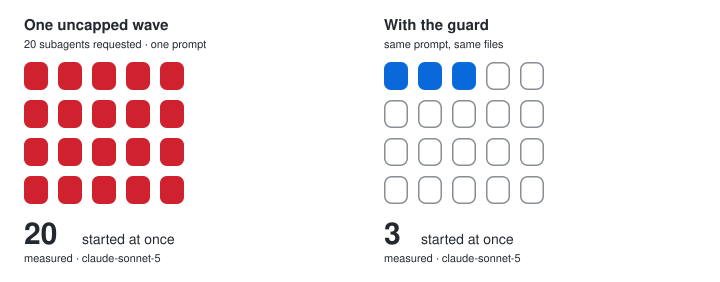

<div align="center">

# handoff-os

**Stops Claude Code from burning your limit on a subagent flood.**

[](plugins/handoff-os/.claude-plugin/plugin.json)
[](https://github.com/serio-ngo/handoff-os/actions/workflows/verify.yml)
[](LICENSE)
[](#install)

[](docs/BENCHMARK.md)
[](docs/BENCHMARK.md)
[](plugins/handoff-os/scripts)
[](package.json)

<!-- handoff-demo -->

<!-- /handoff-demo -->

<sub>[Install](#install) · [What it does](#what-it-does) · [Proof](#proof) · [Method](docs/BENCHMARK.md) · [Contributing](CONTRIBUTING.md)</sub>

</div>

Claude Code can launch 20 subagents in one turn. A 5-hour window goes in seconds.

The hook caps each wave at 3 and queues the rest.

<!-- handoff-flood -->

<!-- /handoff-flood -->

## Install

```text
/plugin marketplace add serio-ngo/handoff-os
/plugin install handoff-os@serio-ngo
```

Restart Claude Code. Hooks load at session start.

## What it does


| Guard | One line |
|---|---|
| Fan-out cap | Three subagents start; the rest go in the next wave. |
| Read budget | A file over 24 KB arrives trimmed instead of whole, and the same unchanged file never arrives twice. |
| Dispatch budget | Every subagent names a tier, and a review goes to sonnet. |
| Egress lock | Sends, payments, publishes, merges and deletes stop before they run — shell, PowerShell and connectors alike. |
| Verify gate | A "done" claim needs a real run behind it. |
| Git writes | Branch, commit and push stop until `HANDOFF_GIT_WRITE=1`. Merge never runs; reads and `gh pr create` always do. |
| Audit trail | One local line per action, appended as it happens. |
| Session receipt | The Stop hook prints what the session kept out of context. |


## Proof


Every case is labelled in `eval/guard-corpus.jsonl` and re-scored on each run against four
comparators. Cost, limits and full method: [docs/BENCHMARK.md](docs/BENCHMARK.md).


<div align="center">
<sub>

[CONTRIBUTING.md](CONTRIBUTING.md) · [SECURITY.md](SECURITY.md) · [docs/BENCHMARK.md](docs/BENCHMARK.md) · [docs/MANIFEST.md](docs/MANIFEST.md) · [docs/CLAUDE_CODE_FACTS.md](docs/CLAUDE_CODE_FACTS.md) · [Apache-2.0](LICENSE)

</sub>
</div>
